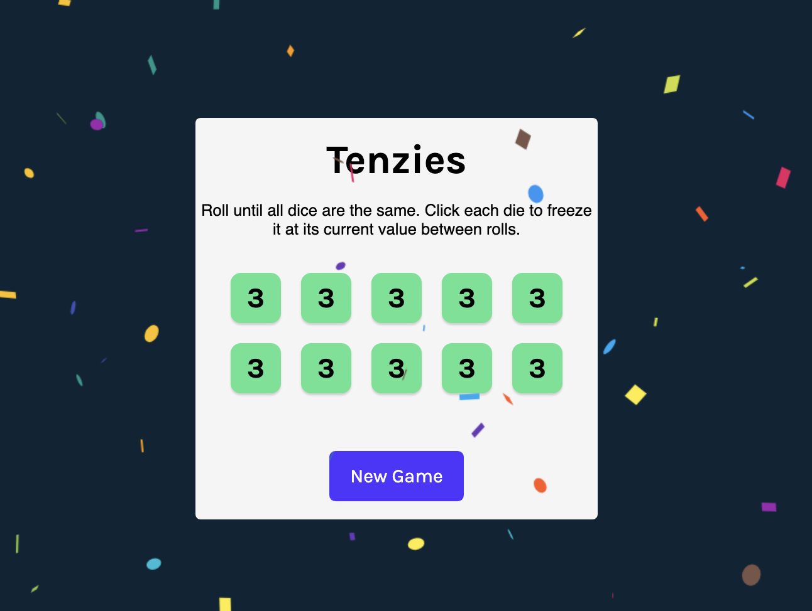

# 🎲 Tenzies Game

A fun dice game built with React where the goal is to roll until all dice are the same. You can hold dice to keep their value while rolling the others!

## 🚀 Live Demo

<!-- (Add the link if you deploy it with GitHub Pages or any hosting site) -->

---

## 🎮 How to Play

- Roll the dice
- Click on a die to **"hold"** its number
- Keep rolling until **all dice show the same number**
- The held dice stay fixed while others change

---

## 🛠️ Tech Stack

- React
- JavaScript
- CSS
- Html
- Vite

---

## 🧑‍💻 Run Locally

1. Clone the repo:

```bash
git clone https://github.com/shardareddy12/tenzies-game.git
cd tenzies-game

